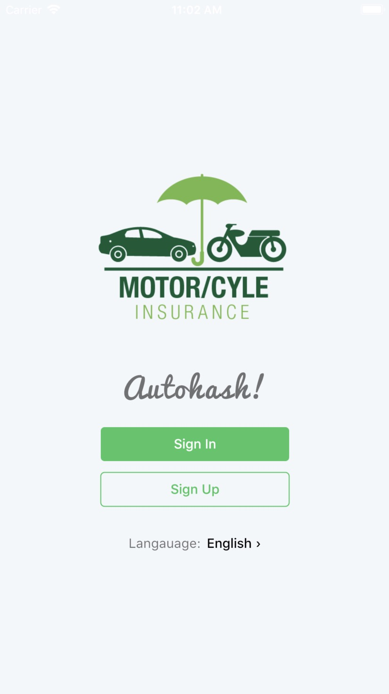
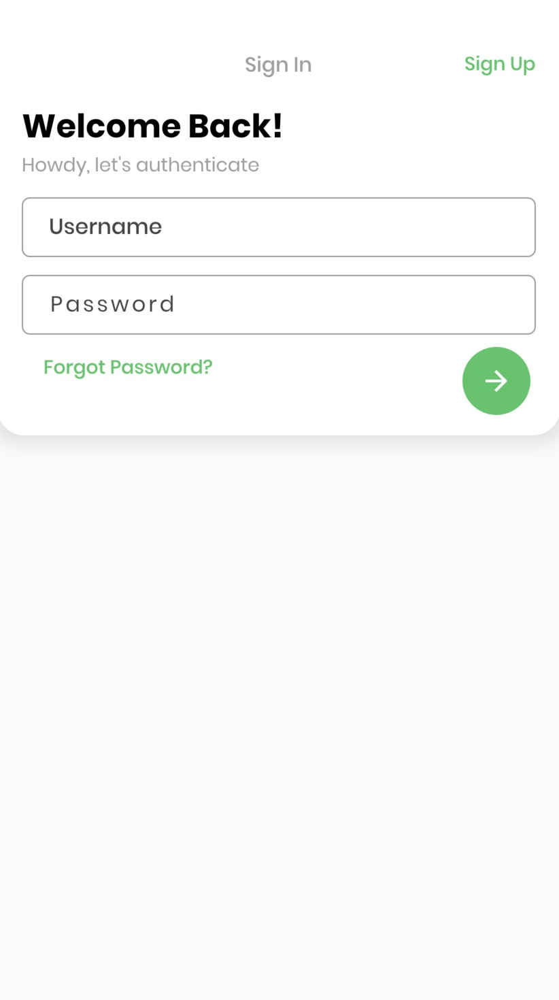
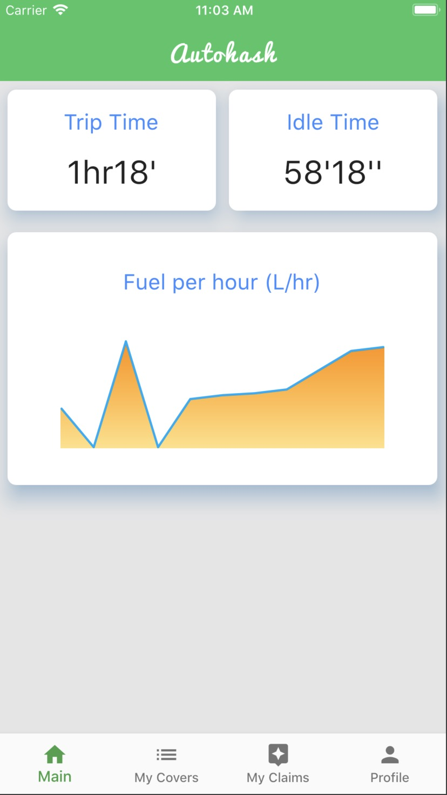
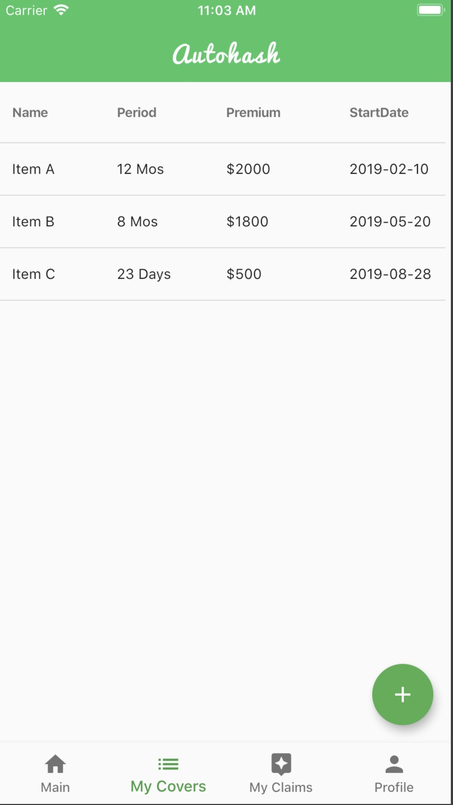
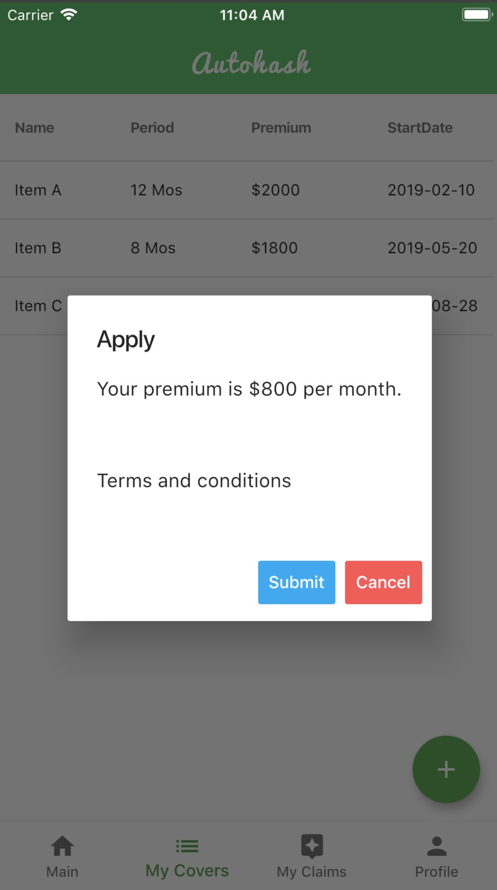
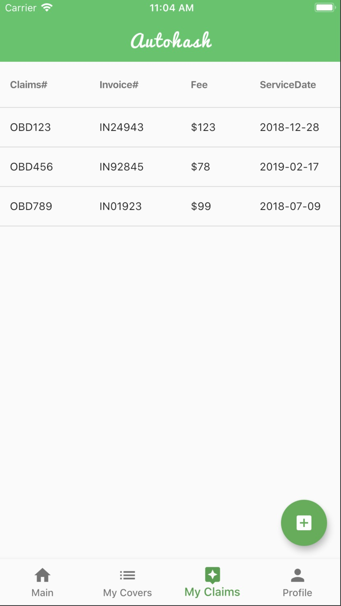
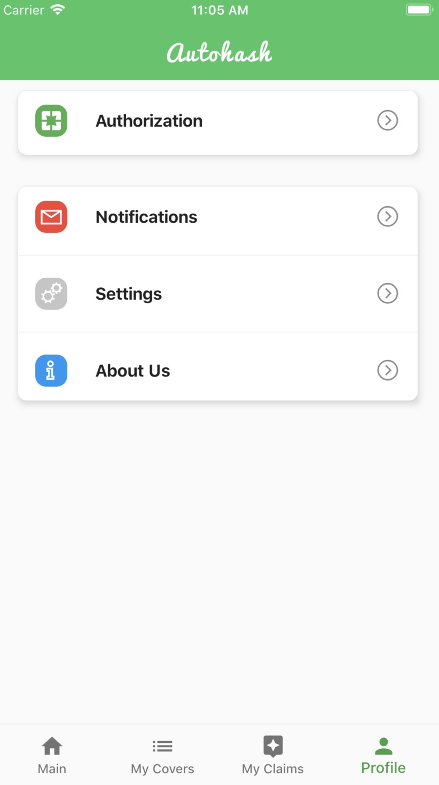
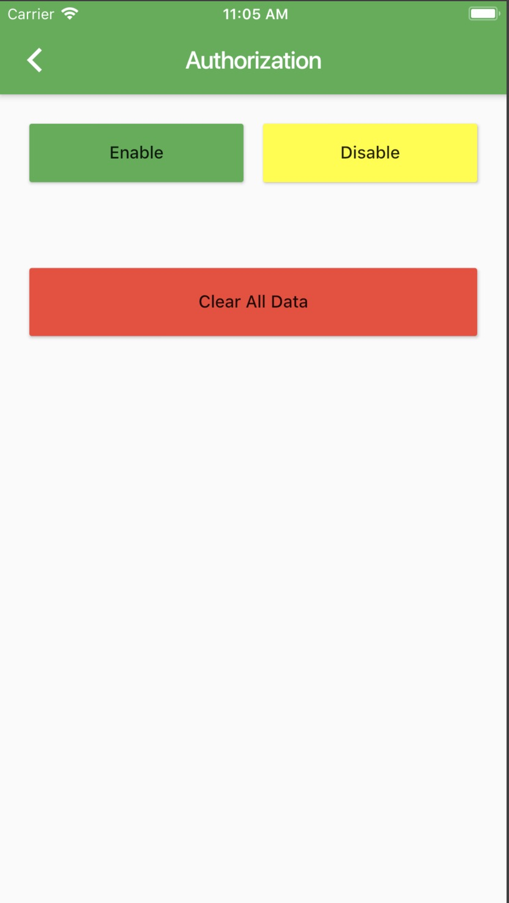

# Autohash TEAM

This is the mobile apps (IOS/ANDROID) for the Fourth Gen. UBI project.

## Getting Started

### Prerequisite

As this project is a starting point for a Flutter application, you have to follow up the following links to setup Flutter runtime/development environment.

A few resources to get you started if this is your first Flutter project:
- [Install Flutter](https://flutter.dev/docs/get-started/install)
- [Lab: Write your first Flutter app](https://flutter.dev/docs/get-started/codelab)
- [Cookbook: Useful Flutter samples](https://flutter.dev/docs/cookbook)

For help getting started with Flutter, view our
[online documentation](https://flutter.dev/docs), which offers tutorials,
samples, guidance on mobile development, and a full API reference.

### TO RUN
`flutter run`

### 📸 Screenshots
The screenshots below are taken on a IOS emulator.

| 1 | 2|
|------|-------|
|||

| 3 | 4|
|------|-------|
|||

| 5 | 6|
|------|-------|
|||

| 7 | 8|
|------|-------|
|||

| 9 |
|------|
||